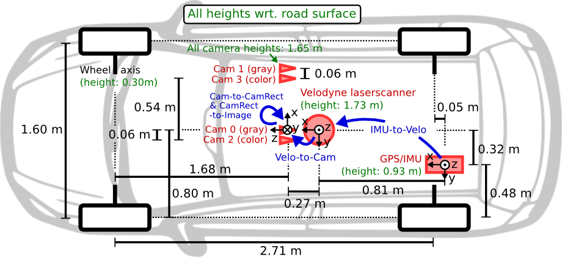
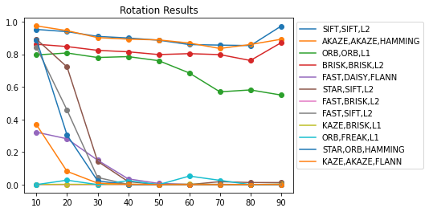
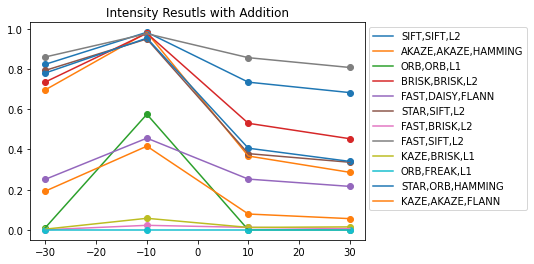
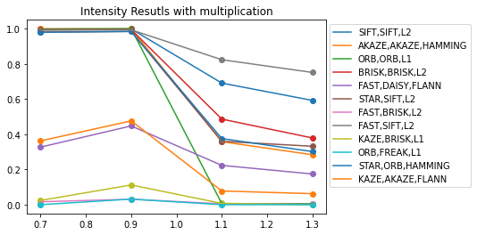

# Evaluating OpenCV's Descriptor and Detectors
## Project Description
In this project we try to find the best combination of OpenCV's Detectors and descriptors for each Scenario that we could encounter while trying to match points (Rotated angle, moving forward, stereo cameras, changing the point of view...ect) and comparing executing time

### Project code
This project was coded in a way where you can change or add a Detector or a descriptor in just few seconds
* first parameter is for a detector
* second parameter is for the descriptor
* third parameter is for the matching method

##### Example

* `method_one = 'SIFT,SIFT,L2'`
* `method_two = 'FAST,AKAZE,L2'`

If the your method does not show in code you can just add it to the `costumized_detector()` function

##### Dataset
Dataset used for this project was Kitti Dataset

#### Detectors used in this project:
* SIFT
* KAZE
* AKAZE
* ORB
* BRISK
* FAST
* STAR

#### Descriptors used in this project:
* SIFT
* KAZE
* AKAZE
* ORB
* BRISK
* DAISY
* SIFT
* FREAK

#### Matching Methods:
* Brute force Euclidian Distance
* Brute force Manhattan Distance
* Hamming Matching (For binary Descriptors)
* FLANN

#### Scenarios that been handled in this project
* Rotation
* Scale
* Intensity shifting
* Intensity Scaling
* Point of view change

### Results
* **Rotation scenario**

* **Scale scenario**

* **Intensity shifting scenario**

* **Intensity scaling**

### Speed Test and number of correct matched points

* **Rectified Camera** : Using Camera 2 and camera 3 (same frame)

|       Method        |    Execution Time    | image Points |    % of inliers    |
|---------------------|----------------------|--------------|--------------------|
|     SIFT,SIFT,L2    |  1.2026803588867188 |     1507     | 67.82181974305533  |
| AKAZE,AKAZE,HAMMING | 0.41569917678833007 |     1057     | 76.02977136429116  |
|      ORB,ORB,L1     | 0.06997089385986328 |     220      | 54.04514155484244  |
|    BRISK,BRISK,L2   |  1.2444156455993651 |     1743     | 64.23926035865172  |
|   FAST,DAISY,FLANN  |  16.774623322486878 |    19104     | 22.035386241527075 |
|     STAR,SIFT,L2    | 0.29939889430999755 |     398      | 51.70069050213015  |
|    FAST,BRISK,L2    |  3.242427387237549  |     3102     | 20.073394440331928 |
|     FAST,SIFT,L2    |  6.360142207145691  |     5000     | 46.869498521420944 |
|    KAZE,BRISK,L1    |  2.024656014442444  |     1087     | 18.75267438005337  |
|     ORB,FREAK,L1    |  0.1049588966369629 |      85      | 1.322288154431402  |  

* **Forward motion** :  using camera 2 for this scenario (frame t and frame + 1)

|       Method        |    Execution Time    | image Points |    % of inliers    |
|---------------------|----------------------|--------------|--------------------|
|     SIFT,SIFT,L2    |  1.4541015815734863 |     1507     | 67.82181974305533  |
| AKAZE,AKAZE,HAMMING |  0.5840019083023071 |     1057     | 76.02977136429116  |
|      ORB,ORB,L1     | 0.08860401153564453 |     220      | 54.04514155484244  |
|    BRISK,BRISK,L2   |  0.9555487775802612 |     1743     | 64.23926035865172  |
|   FAST,DAISY,FLANN  |  10.89764416217804  |    19104     | 22.035386241527075 |
|     STAR,SIFT,L2    |  0.3065471076965332 |     398      | 51.70069050213015  |
|    FAST,BRISK,L2    |   2.75267728805542  |     3102     | 20.073394440331928 |
|     FAST,SIFT,L2    |  5.172807865142822  |     5000     | 46.869498521420944 |
|    KAZE,BRISK,L1    |  1.6734687662124634 |     1087     | 18.75267438005337  |
|     ORB,FREAK,L1    | 0.06910722732543945 |      85      | 1.322288154431402  |

* **Point of view change** :  Using Camera 2 and camera 3 in Frame + 1

|       Method        |    Execution Time    | image Points |    % of inliers    |
|---------------------|----------------------|--------------|--------------------|
|     SIFT,SIFT,L2    |  1.4300354646176707 |     1415     |  66.3599150745823  |
| AKAZE,AKAZE,HAMMING |  0.5008082925056925 |     939      | 78.22428299647429  |
|      ORB,ORB,L1     | 0.07813528119301309 |     197      | 60.02833874675781  |
|    BRISK,BRISK,L2   |  1.1350352374874815 |     1604     | 65.55277122538197  |
|   FAST,DAISY,FLANN  |  11.21242007430719  |    19034     | 47.58531519192286  |
|     STAR,SIFT,L2    | 0.21953818262839803 |     363      | 79.03677077927321  |
|    FAST,BRISK,L2    |  2.774692048831862  |     2833     |  38.5281586463187  |
|     FAST,SIFT,L2    |  5.912048407963344  |     4394     | 85.29054162945961  |
|    KAZE,BRISK,L1    |  1.3799451419285365 |     940      | 23.492813978682403 |
|     ORB,FREAK,L1    | 0.06925193144350636 |      76      | 17.051412609243087 |

* **Point of view change** :  Using Camera 2 and camera 3 in Frame + 2

|       Method        |    Execution Time    | image Points |    % of inliers    |
|---------------------|----------------------|--------------|--------------------|
|     SIFT,SIFT,L2    |  1.4115840047597885 |     1535     | 77.22183943528765  |
| AKAZE,AKAZE,HAMMING | 0.48258795340855914 |     1030     | 85.86317008610872  |
|      ORB,ORB,L1     |  0.076199010014534  |     234      | 77.91809268236432  |
|    BRISK,BRISK,L2   |  1.0138863722483318 |     1726     |  78.1032573771128  |
|   FAST,DAISY,FLANN  |  11.896301204959551 |    15656     | 56.59739677498384  |
|     STAR,SIFT,L2    |  0.2204746057589849 |     399      | 85.06618113752234  |
|    FAST,BRISK,L2    |  2.8526683499415717 |     2987     | 52.27710836699993  |
|     FAST,SIFT,L2    |  6.002367461721103  |     4412     | 89.42414491491544  |
|    KAZE,BRISK,L1    |  1.6176450550556183 |     1096     | 30.975487875956727 |
|     ORB,FREAK,L1    | 0.07935733596483867 |      92      | 14.491732848338124 |
